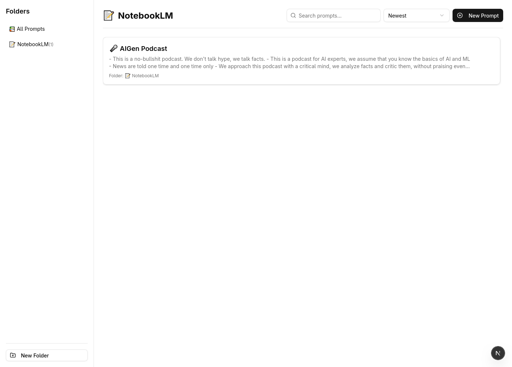

# The Prompt Cloud

A modern web platform designed as a personal reservoir for prompts used with Large Language Models (LLMs).
Organize, search, sort, and retrieve your prompts efficiently.



## Tech Stack

- **Frontend:**
  - [Next.js](https://nextjs.org/) (v14+ with App Router)
  - [React](https://reactjs.org/) (v19)
  - [TypeScript](https://www.typescriptlang.org/)
  - [Tailwind CSS](https://tailwindcss.com/)
  - [shadcn/ui](https://ui.shadcn.com/) (Component Library)
  - [SWR](https://swr.vercel.app/) (Data Fetching)
  - [React Hook Form](https://react-hook-form.com/) (Form Handling)
  - [Zod](https://zod.dev/) (Schema Validation)
  - [Lucide React](https://lucide.dev/) (Icons)
  - [Sonner](https://sonner.emilkowal.ski/) (Toast Notifications)
  - [Emoji Picker React](https://github.com/ealush/emoji-picker-react)
  - [use-debounce](https://github.com/xnimorz/use-debounce)
- **Backend:**
  - [Node.js](https://nodejs.org/)
  - [Express](https://expressjs.com/)
  - [TypeScript](https://www.typescriptlang.org/)
  - [Prisma](https://www.prisma.io/) (ORM)
  - [PostgreSQL](https://www.postgresql.org/) (Database)
- **Development:**
  - [Nodemon](https://nodemon.io/) (Backend Auto-Reload)
  - [ts-node](https://github.com/TypeStrong/ts-node) (TypeScript Execution for Node)

## Project Structure

```
.
├── backend/
│   ├── prisma/           # Prisma schema and migrations
│   │   ├── generated/    # Generated Prisma Client
│   │   ├── lib/          # Shared utilities (e.g., Prisma client instance)
│   │   ├── routes/       # API route handlers (folders, prompts)
│   │   └── server.ts     # Express server setup
│   ├── .env.example      # Example environment variables
│   ├── package.json
│   └── tsconfig.json
├── frontend/
│   ├── public/           # Static assets
│   ├── src/
│   │   ├── app/          # Next.js App Router pages and layouts
│   │   ├── components/
│   │   │   ├── actions/  # Client components for CRUD, forms, modals
│   │   │   └── ui/       # shadcn/ui components
│   │   ├── lib/          # Utilities (API client, utils)
│   │   └── globals.css   # Global styles
│   ├── .env.local.example # Example environment variables
│   ├── components.json   # shadcn/ui configuration
│   ├── next.config.mjs
│   ├── package.json
│   ├── postcss.config.mjs
│   ├── tailwind.config.ts
│   └── tsconfig.json
└── README.md           # This file
```

## Getting Started

### Prerequisites

- [Node.js](https://nodejs.org/) (v18 or later recommended)
- [npm](https://www.npmjs.com/) or [yarn](https://yarnpkg.com/)
- [PostgreSQL](https://www.postgresql.org/) database running

### Setup

1. **Clone the repository:**

   ```bash
   git clone https://github.com/federicotorrielli/the-prompt-cloud.git
   cd the-prompt-cloud
   ```

2. **Backend Setup:**

   ```bash
   cd backend
   npm install
   ```

   - Create a `.env` file (copy from `.env.example`).
   - Set your `DATABASE_URL` in the `.env` file.
     _(See [Prisma connection URL docs](https://www.prisma.io/docs/reference/database-reference/connection-urls) for format)_.
   - Run database migrations:

     ```bash
     npx prisma migrate dev --name init
     ```

     _(If you encounter permissions errors, you might need to grant your DB user `CREATEDB` privileges or adjust your setup)._
     _(Ensure `npx prisma generate` runs successfully after migration)_.

3. **Frontend Setup:**
   ```bash
   cd ../frontend
   npm install
   ```
   - _(Optional)_ Create a `.env.local` file if you need to override the default backend API URL (`NEXT_PUBLIC_API_URL`). The default (`http://localhost:3001/api`) should work if running locally.

### Running the Application

1. **Start the Backend Server:**

   ```bash
   cd backend
   npm run dev
   ```

   _(The backend will run on `http://localhost:3001` by default)_.

2. **Start the Frontend Server:**
   _(In a separate terminal)_

   ```bash
   cd frontend
   npm run dev
   ```

   _(The frontend will run on `http://localhost:3000` by default)_.

3. Open [`http://localhost:3000`](http://localhost:3000) in your browser.

## Key Features

- **Folder Management:** Create, edit, and delete folders to organize prompts.
- **Prompt Management:** Create, edit, and delete prompts.
- **Folder Assignment:** Assign prompts to folders (or leave them unassigned).
- **Emoji Support:** Assign emojis to folders and prompts for visual identification.
- **Emoji Pickers:** User-friendly emoji selection for folders and prompts.
- **Search:** Filter prompts by title or content in real-time (debounced).
- **Sorting:** Sort prompts by creation date or title (ascending/descending).
- **Prompt Detail View:** Click a prompt card to view its full content and details in a modal.
- **Copy Prompt:** Quickly copy prompt content to the clipboard.
- **Responsive Design:** Basic layout adapts to different screen sizes.
- **Loading States:** Skeletons and spinners provide feedback during data loading.
- **Notifications:** User feedback via toasts (Sonner).

## Potential Future Enhancements

- Prompt Tagging/Categorization
- Sharing Prompts/Folders (Public/Private links)
- User Accounts & Authentication
- More Advanced Search (fuzzy search, filtering by tags)
- Prompt Version History
- Bulk Actions (move/delete multiple prompts)
- Import/Export Functionality
- Enhanced WYSIWYG or Markdown editor for prompt content
- Dark/Light Mode Toggle (currently relies on system preference via Tailwind)
- Mobile App / PWA
